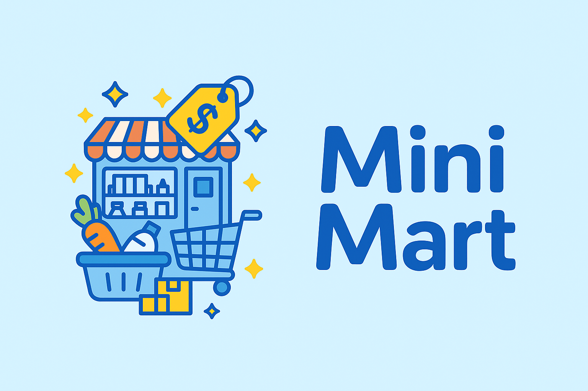
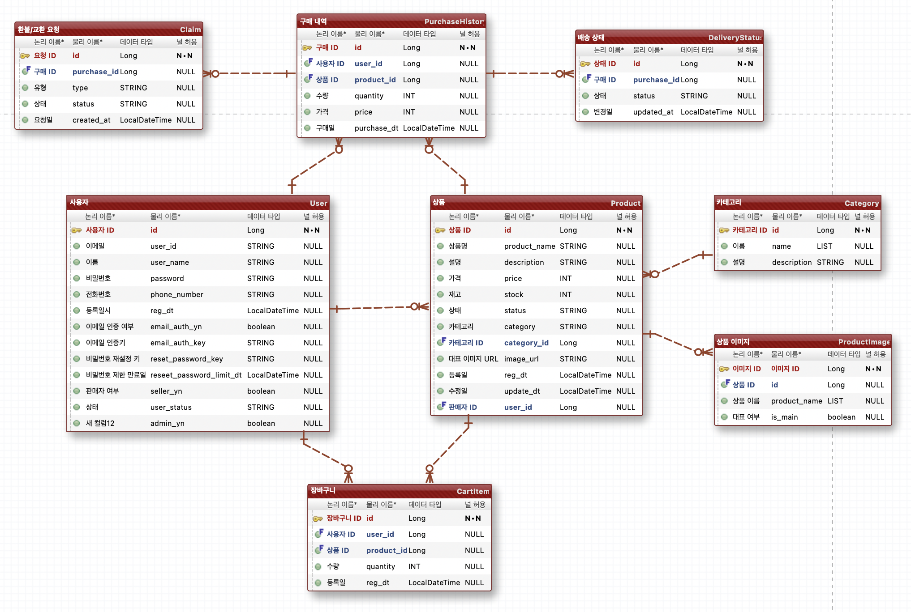

# 🛒 Mini-Mart - 커머스 프로젝트

## 📌 프로젝트 개요

---

단순한 쇼핑몰 기능을 구현한 백엔드 중심의 커머스 시스템입니다. 
판매자와 구매자가 각각의 역할에 따라 상품을 등록, 검색, 구매, 관리할 수 있도록 구성되어 있습니다.

## 🛠 기술 스택

---

- Language: Java 17+
- Framework: Spring Boot 3
- Build Tool: Gradle
- Database: MySQL 8, Redis
- ORM: JPA (Hibernate)
- Testing: JUnit5, Mockito
- Authentication: Spring Security
- View: Thymeleaf

## ⚙️ 주요 구현 기능

---

### 👤 사용자 (회원) 기능

- 회원가입 / 로그인 / 로그아웃
- 로그인된 상태에서 로그인·회원가입 진입 제한
- 회원 정보 조회 및 수정 (비밀번호 / 전화번호 변경 포함)
- 비밀번호 찾기 (이메일 인증 및 재설정)
- 판매자 계정 신청 (전화번호 인증 기반)
- 이메일 인증 기반 로그인 활성화

### 🛍️ 판매자 기능

- 판매 상품 등록 (상품명, 가격, 설명, 이미지, 카테고리, 재고 수량, 판매 상태)
- 판매 상품 수정 및 삭제
- 나의 판매 내역 조회
- 상품 상세 페이지 (판매자 전용)
- 이미지 등록 및 관리
- 판매자 UI 개선

### 🔎 검색 및 상품 조회

- 상품 메인 검색 페이지 구현
- 상품 목록 검색 (키워드 + 카테고리)
- 상품 상세 페이지 (공용)
- 검색 결과 페이지 UI 개선
- 비회원 검색 가능

### 🧺 장바구니 및 결제 기능

- 장바구니 담기 / 수정(수량) / 삭제
- 장바구니 페이지 진입 제어 (로그인 사용자만 접근 가능)
- 선택 항목 구매 → 구매 내역에 저장 및 장바구니에서 제거
- 구매 내역 페이지 구성 (상품명, 수량, 가격, 구매일 등 표시)

## ⏳ 구현 예정 기능

---

### 📦 상품 기능

- 상품 디테일 추가: 옵션, 할인, 배송비, 배송 소요일 등
- 대표 이미지 설정 기능
- 상품 카테고리 고도화: List 기반 유연 구조

### 📑 장바구니 고도화

- 장바구니 목록 및 판매 목록 페이징 처리
- 장바구니 옵션/리뷰 작성 기능

### 📬 구매 후 처리

- 구매 내역의 상태 관리 (배송중, 배송완료, 구매확정 등)
- 환불 및 교환 요청 기능 (Claim 테이블 기반)

### 🎯 추가 기획 요소

- 베스트 상품, 할인 상품, 신상품 표시
- 상품 옵션 선택 기능
- 관리자 기능: 전체 사용자 관리, 상품 승인 등 (추가 설계 필요)

## 🗂 ERD 구조

---

  

전체 테이블은 다음과 같이 구성되어 있으며, 구매, 배송, 환불 등 모든 커머스 전 과정을 확장 가능하도록 설계되었습니다.

논리적/물리적 이름 및 관계 설명은 ERD 설명 문서 또는 eXERD 파일 참조
- 사용자 (User)
- 상품 (Product)
- 장바구니 (CartItem)
- 구매내역 (PurchaseHistory)
- 카테고리 (Category)
- 상품이미지 (ProductImage)
- 배송상태 (DeliveryStatus)
- 환불/교환요청 (Claim)
- 
---