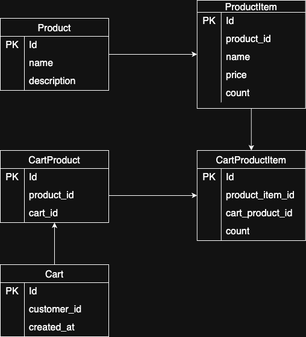

# 🛒 커머스 장바구니 프로젝트

---

#### 간단한 커머스 프로젝트

## 🎯 프로젝트 목표

---

판매자 : 상품 등록, 수정, 삭제 등 서비스 구현  
구매자 : 상품 검색, 장바구니 담기 등 서비스 구현

## 🛠️ 활용 기술 소개

---

- Spring boot
- Gradle
- JPA
- Junit5
- Mysql
- Redis
- Mockito

## ⚙️ 프로젝트 기능 및 설계

---

- ### 🙋‍♂️ 사용자 기능
  - [x] 회원가입
  - [ ] 비밀번호 확인과 동일 시 회원가입
  - [ ] 이메일 인증 시 완료 시에만 로그인 가능 기능
  - [x] 로그인, 로그아웃
  - [x] 회원 정보 보기 및 수정
  - [x] 회원 정보 수정 - 비밀번호 변경
  - [x] 회원 정보 수정 - 전화번호 변경
  - [x] 판매자 계정 신청 (전화번호를 통해 1인당 1개만 승인)
  - [x] 로그인 화면에서 비밀번호 찾기

- ### 🛍️ 판매 상품 등록 / 수정 / 삭제
  - [x] 판매 상품 등록
    - 상품명
    - 가격
    - 상세 설명
  - [x] 나의 판매 내역
  - [x] 판매상품 디테일 추가 1
    - 이미지
    - 카테고리 선택
    - 재고 수량
    - 판매 상태
  - [ ] 상품 상세 페이지 - 판매자
  - [ ] 판매 상품 수정
  - [ ] 판매 상품 삭제
  - [ ] 나의 판매 내역 페이징 처리
  - [ ] 판매상품 디테일 추가 2
    - 상품 옵션
    - 할인, 종료일
    - 배송비, 소요일
    - 리뷰

- ### 🔎 상품명 검색 기능
  - [ ] 상품 검색
  - [ ] 상품 목록 
  - [ ] 상품 상세 페이지 - 공용
  - [ ] 상품 목록 페이징 처리

- ### 🧺 상품 장바구니 기능
  - [ ] 상품 담기
  - [ ] 장바구니 조회
  - [ ] 장바구니 상품 삭제
  - [ ] 장바구니 목록 페이징 처리

- ### 🔄 로그인 / 로그아웃에 따른 장바구니 접근 허가 기능 구현
  - [ ] 

- ### 🌟 추가 기능
  - [ ] 

## 🗂 ERD

---

  